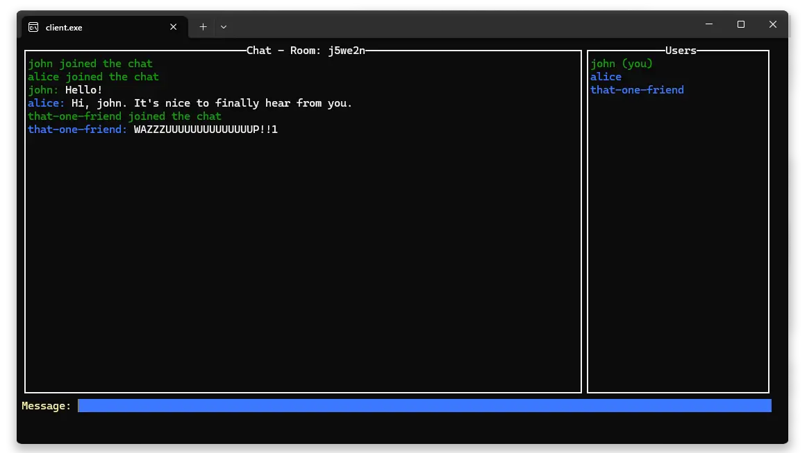

# Secure Chat Application

A secure, end-to-end encrypted chat application built with Go, featuring a terminal-based UI and WebSocket communication.



## Features

- 🔒 **End-to-End Encryption** - PGP encryption with automatic key management
- 💬 **Real-time Chat** - WebSocket-based messaging with multiple users
- 🏠 **Room-based Chat** - Multiple isolated chat rooms with unique IDs
- 🖥️ **Terminal UI** - Clean interface built with tview and tcell
- 🐳 **Docker Support** - Optimized deployment (~6MB server image)
- � **Lightweight** - Minimal dependencies using standard net/http. ~1.6MB RAM usage for server in idle state, about 2.5MB with two clients connected.
- 🗑️ **Ephemeral** - No message storage, server only routes encrypted data

## Quick Start

### Running Locally

1. **Start the Server:**

   ```bash
   go run ./server
   ```

2. **Start Clients:**
   ```bash
   go run ./client
   ```
   Or specify username and room ID:
   ```bash
   go run ./client username room-id
   ```

### Using Docker

```bash
docker build -t secure-chat-server .
docker run -p 8080:8080 secure-chat-server
```

Then start clients locally: `go run ./client`

### Configuration

Create a `.env` file to configure the server URL:

```bash
# Copy the example file
cp .env.example .env

# Edit the server URL if needed
# SERVER_URL=ws://your-server.com:8080/ws
```

## How It Works

1. **Connection**: Client generates PGP key pair on startup and joins specified room
2. **Room Management**: Rooms created automatically, deleted when last user leaves
3. **Key Exchange**: Public keys automatically shared between users in same room
4. **Messaging**: Messages encrypted for each recipient in the room
5. **Decryption**: Each user decrypts with their private key
6. **Cleanup**: When a user disconnects, their keys are deleted and the chat history is cleared from the UI for everyone

**Security**: Server only routes encrypted messages - cannot read content or store data

## Usage

**Interface**: Chat area, live user list, and input field

**Commands**:

- `/clear` - Clear chat history
- `/help` - Show available commands

## Dependencies

- [gorilla/websocket](https://github.com/gorilla/websocket) - WebSocket implementation
- [rivo/tview](https://github.com/rivo/tview) - Terminal UI library
- [gdamore/tcell](https://github.com/gdamore/tcell) - Terminal cell library
- [ProtonMail/gopenpgp](https://github.com/ProtonMail/gopenpgp) - PGP encryption library

## Acknowledgments

Built with Go, using standard `net/http` and ProtonMail's gopenpgp for PGP encryption
